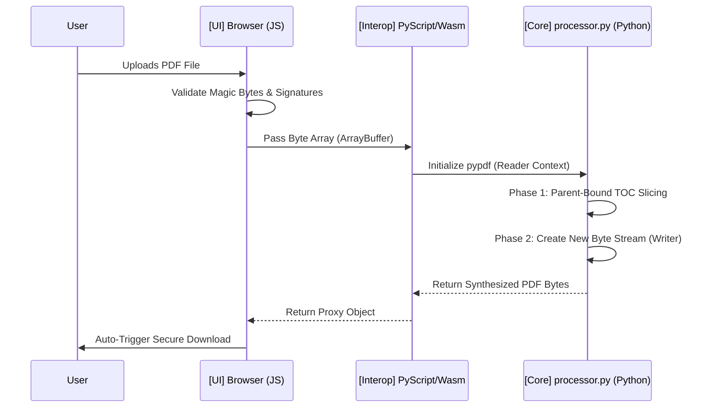

# How It Works: Zero-Trust PDF Truncation

PDF Trim is a highly secure, private-by-design tool for extracting specific portions of large PDF documents. Unlike traditional tools, it never sends your data to a server. Everything happens right in your browser.

## 1. The Three-Layer Architecture

The system is built on three core pillars that work together to ensure privacy and performance:

### 🏛️ The PWA Frontend (The User Interface)
Built with **HTML5, CSS3, and JavaScript**, this is the layer you interact with. 
- **Privacy First:** It handles file selection locally.
- **Offline Ready:** Using Service Workers, the app works without an internet connection once loaded.
- **Secure Buffer:** It reads your PDF into a secure memory buffer (ArrayBuffer) before passing it to the engine.

### 🌉 The PyScript Bridge (The Interop Layer)
This is the "handshake" between the web browser and the processing engine.
- **Data Transfer:** It securely moves the raw bytes of your PDF from the JavaScript environment into the Python environment.
- **Wasm Power:** It leverages **WebAssembly (Wasm)** to run Python code directly in the browser at near-native speeds.

### 🚂 The `processor.py` Engine (The Brain)
The heart of the system, running the **pypdf** library inside the Wasm sandbox.
- **Surgical Precision:** It parses the internal structure of the PDF.
- **Intelligent Extraction:** It applies advanced logic (like Parent-Bound Slicing) to find exactly what you need.
- **Clean Synthesis:** It reconstructs a new, smaller PDF from the extracted pages and sends it back to you.

---

## 2. Parent-Bound Slicing Logic

The "Parent-Bound Slicing" algorithm is what makes the **Executive Mode** so powerful. Instead of just searching for text, it understands the "Table of Contents" (bookmarks) of the PDF.

### How it traverses the tree:
1. **Bookmark Discovery:** The engine scans the PDF's internal bookmark tree (the hierarchy you see in a sidebar).
2. **Contextual Boundaries:** When it finds a target section (e.g., "Remuneration Report"), it doesn't just take that one page. It looks at the **Parent-Child relationship**.
3. **Surgical Extraction:** It identifies where the *next* bookmark at the same level begins. It then "slices" every page from the start of your target section until the start of the next section.
4. **Clean Exit:** This ensures that even if a section is 20 pages long, the engine captures the entire relevant block without needing to guess based on keywords on every page.

---

## 3. The Data Flow (Sequence Diagram)

This diagram visualizes how your data travels safely through the system without ever leaving your machine.

---

## Technical Security Note
Because the **WebAssembly sandbox** is isolated from your file system and network, this tool is "air-gapped" by default. Your sensitive corporate documents never touch a cloud server, ensuring 100% data residency and zero-trust compliance.